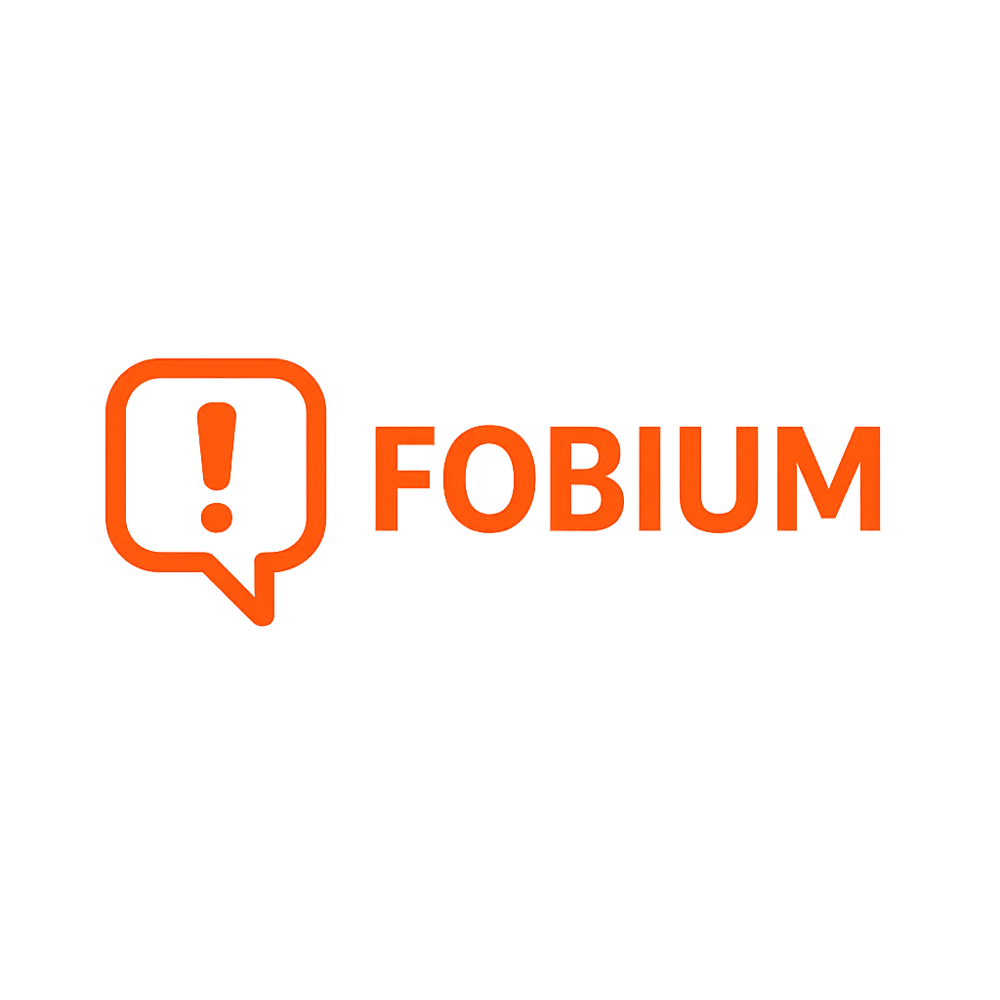

# TP2-IDS

<div align="center">
   
   <br>
   <h3>🧠 Foro de Fobias 🧠</h3>
</div>

---
<div align="center">
<br>Trabajo Práctico 2 - Introducción al Desarrollo de Software (Camejo) - FIUBA<br>

🌐 **URL Deploy:** [https://www.fobium.com/](https://www.fobium.com/)
</div>

---

## Descripción general

Este proyecto es una aplicación web desarrollada como parte del TP2 de la materia Introducción al Desarrollo de Software. El sistema permite a los usuarios registrarse, loguearse, crear y gestionar "fobias", comentar, y ver rankings, todo a través de una interfaz web conectada a un backend robusto y una base de datos relacional. El objetivo fue aplicar buenas prácticas de desarrollo, trabajo en equipo y uso de herramientas modernas vistas en clase.


## Estructura del proyecto

```
TP2-NOMBRE-TP/
├── docs/                    <-- Documentaciones técnicas específicas
├── backend/                 <-- API REST, script de base de datos y tests
├── frontend/                <-- Sitio web estático, páginas HTML, CSS, JS y recursos multimedia
├── docker-compose.yml       <-- Para levantar toda la app (backend, frontend y base de datos)
├── README.md                <-- Este archivo con guía general y enlaces útiles
├── .gitignore
```

## Tecnologías Utilizadas

- **Backend:** Python (FastAPI), PostgreSQL, Docker
- **Frontend:** HTML, CSS, JavaScript
- **Control de versiones:** Git & GitHub
- **Testing:** Colecciones Postman (testing API)
- **Automatización:** Docker Compose


## Instalación y ejecución rápida

1. Clonar repositorio
2. Levantar todo el sistema con Docker Compose

```bash
git clone https://github.com/ianchu0317/TP2-IDS.git
cd TP2-IDS
docker-compose up --build
```

Luego de ejecutar se puede acceder localmente en
- Frontend: [http://localhost:80](http://localhost:80)
- Backend/API: [http://localhost:8000](http://localhost:8000)
- Base de datos: puerto 5432 (ver credenciales en docs/database.md)

## Configuraciones de ejecución
Para las configuraciones customizadas se puede editar el archivo `.env` que permite cambiar variables como puertos, API key, llaves secretas, base de datos, entre otros.

El frontend detecta automáticamente si se quiere correr local o si está en producción. En caso de que está en producción hay que cambiar los URL de producción en el archivo de configuración del frontend ubicado en `frontend/assets/js/config.js`.

Por defecto el archivo `.env` está apuntado todo hacia una ejecución local y con API keys inválidas (conseguir gratis con GEMINI). 

## Documentación técnica

- **API y endpoints:** `docs/api.md`
- **Backend y ejecución:** `docs/backend.md`
- **Base de datos y scripts:** `docs/database.md`
- **Convenciones y contribución:** `docs/contribucion.md`
- **Enunciado y requisitos:** `docs/enunciados.md`


## Créditos

- **Integrantes:** Lia Jhong Laos, Facundo Becker, Felipe Jacome, Ian Chen
- **Materia:** Introducción al Desarrollo de Software (Camejo) - FIUBA


## Notas finales

- Para detalles de endpoints, estructura de datos, ejemplos de uso y scripts, consultá la documentación específica en la carpeta `/docs` o en `http://localhost:8000/docs` (swagger).
- No abusar de la creación de posts, ya que el API de la IA tiene un límite de uso.
- El sistema utiliza Cloudflare, por lo que algunos cambios pueden demorar en reflejarse debido al caché de los servidores DNS.
- Si la página no carga correctamente, intentá refrescar o esperar unos minutos.
- Todo el sistema está funcional, pero seguimos mejorando detalles visuales y de experiencia de usuario.

---

## Capturas de pantalla y funcionamiento
La pagina de inicio `index.html` se listan todas las publicaciones de todos los usuarios. En esta página se puede acceder los posts individualmente y ver sus comentarios, y también likear publicaciones de otros o de vos mismo.


En las publicaciones individuales se pueden editar la publicaciones (si sos creador), eliminar la publicación, y ver los comentarios de la gente acerca de la publicación. Cabe destacar que el primer comentario de cada mensaje utiliza una IA (API de Gemini) para comentar de qué tan raro es el creador en el mundo.


Para poder crear una publicacion, comentar o ver el perfil en la plataforma se debe crear primero un usuario y logearse, sino aparece el mensaje de alerta. Los mensajes de alerta te dicen qué fue el error y que tenes que hacer. También te redirige a la pagina de login si fue ese el error 


Login


Registro


Una vez logeado, el usuario puede: crear publicaciones, comentar, y ver su perfil (en `profile.html`)


